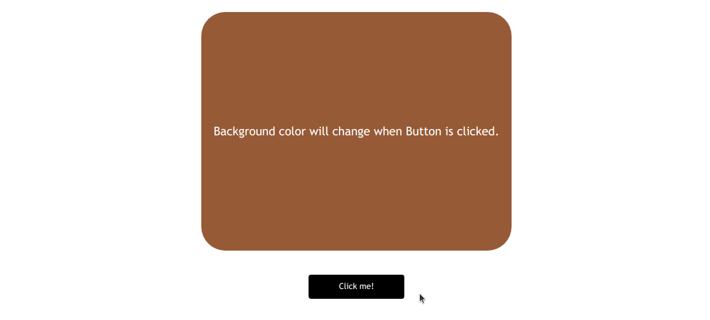
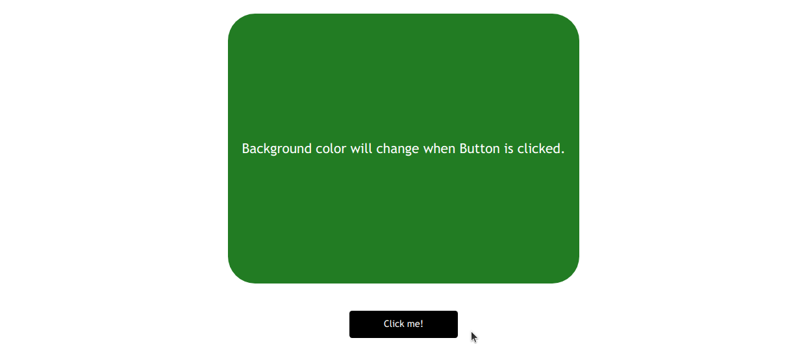

### Color Changer

***
_random color will be generate every time when user click on button_

>following JavaScript concepts used:

1. For loop
2. EventListener
3. Arrow Function
4. Math Function
5. querySelector
6. variables

